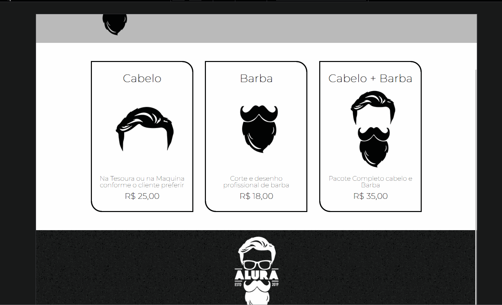
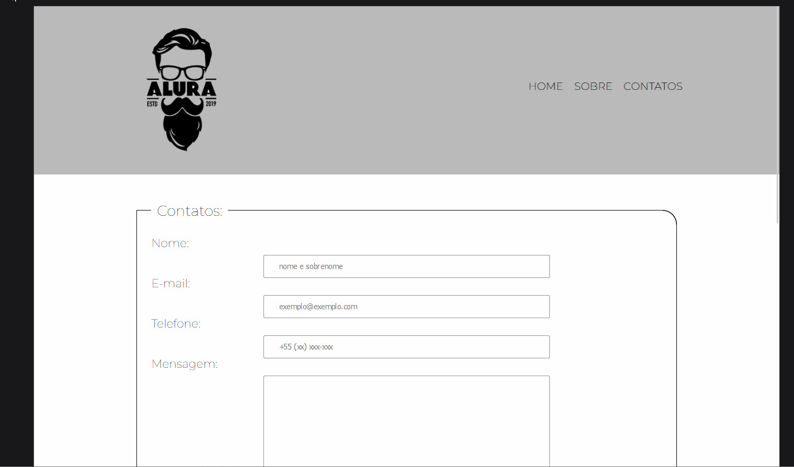

# Projeto Barbearia 

Projeto desenvolvido com o curso de formação para HTML e CSS da escola ALURA, neste projeto foram aplicados técnicas atuais de manipulação de tags HTML para desenvolvimento da página de WEBSITE para uma empresa de barbearia.
Tendo como foco o uso de HTML como linguagem de marcação para identificar e definir elementos da página.
Usando também CSS como linguagem de estilização para definir estilo e performaça ao conteúdo da página.

A página desenvolvida neste projeto possue 3 layout, sendo a primeira o INDEX onde contem detalhes para aquisição o produto principal da empresa, home onde fala sobre a empresa e detalhes sobre a marca, e contato onde o cliente poderá preencher o formulário de contato e solicitar mais informações ou marcar agenda.

### sobre

### Produtos

### Contato

